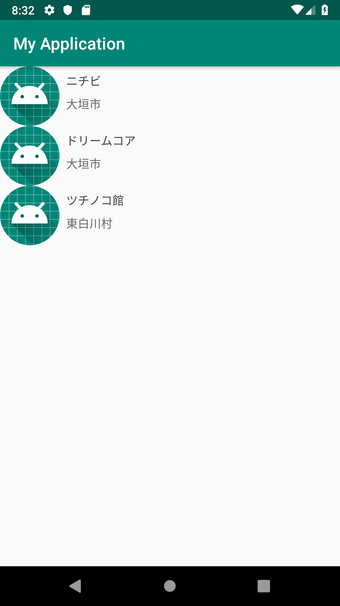

# Androidアプリ開発勉強会
これは3/19に行われたAndroidアプリ開発勉強会で作ったアプリのソースコードです。
## 資料
 - https://speakerdeck.com/derapsen/android-study-session
## アプリ作成の際にさわったところ
 - https://github.com/ishiharaishihara/AndroidStudyGroup/tree/master/app/src/main/res/layout
 - https://github.com/ishiharaishihara/AndroidStudyGroup/tree/master/app/src/main/res/values
 - https://github.com/ishiharaishihara/AndroidStudyGroup/tree/master/app/src/main/java/com/example/myapplication
## スクリーンショット
### MainActivity 

### DetailActivity 

